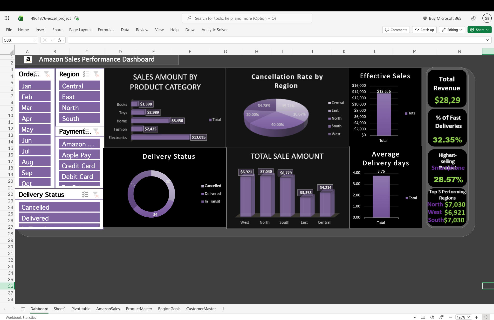

# Amazon Sales Performance Dashboard

## Project Overview
This project focuses on cleaning, transforming, and analyzing Amazon sales data using Microsoft Excel. An interactive dashboard was developed to provide insights into sales performance, delivery status, revenue trends, and regional performance.

## Tools Used
- Microsoft Excel
- Pivot Tables
- Pivot Charts
- Slicers
- Data Cleaning
- Data Visualization

## Key Features
- Cleaned and organized raw sales data
- Built interactive dashboard using Pivot Tables and Pivot Charts
- Added slicers for dynamic filtering by Month, Region, Payment Method, and Delivery Status
- Analyzed sales amount by product category
- Evaluated cancellation rates across regions
- Tracked delivery performance and average delivery days
- Generated business insights through KPI cards and visualizations

## Skills Demonstrated
- Data Cleaning
- Data Analysis
- Dashboard Design
- Business Intelligence
- Excel Reporting
- Data Visualization

## Dashboard Preview

## Project Files
- Amazon_Sales_Performance_Dashboard.xlsx
- dashboard_overview.png

## Business Insights
- Electronics generated the highest sales revenue among product categories.
- North region showed strong sales performance.
- Delivery performance and cancellation trends were analyzed across regions.
- Interactive filters allow deeper exploration of sales patterns.

## Author
Gagan Bawankule
